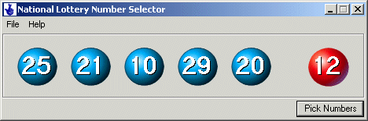



## lottery number selector

### Description

This program is a random number generator designed to help you pick new and different national lottery numbers. It was part of my college assignment to demonstrates the Random function and also the use If statements.
 
### More Info
 

             |
---                |---
**Submitted On**   |2002-10-19 03:40:16
**By**             |[Steven C C](https://github.com/Planet-Source-Code/PSCIndex/blob/master/ByAuthor/steven-c-c.md)
**Level**          |Beginner
**User Rating**    |4.0 (8 globes from 2 users)
**Compatibility**  |VB 5\.0, VB 6\.0
**Category**       |[Complete Applications](https://github.com/Planet-Source-Code/PSCIndex/blob/master/ByCategory/complete-applications__1-27.md)
**World**          |[Visual Basic](https://github.com/Planet-Source-Code/PSCIndex/blob/master/ByWorld/visual-basic.md)
**Archive File**   |[lottery\_nu14839710192002\.zip](https://github.com/Planet-Source-Code/steven-c-c-lottery-number-selector__1-39958/archive/master.zip)

